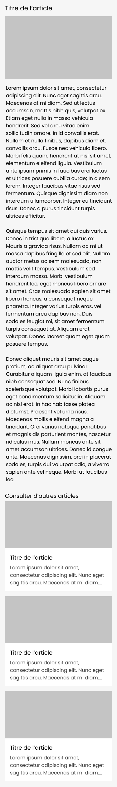

# Tâches à réaliser
1. Créez un controller `src\Controller\DefaultController` avec une méthode `hello` dans le fichier
    - route `/hello`
    - accessible uniquement en GET
    - avec comme retour au format JSON `{"hello":"world!"}`
2. Créez une entité Article comprenant les champs suivants :

   | champ        |  type   | limite | nullable |
   |:-------:|:------------:|:--------:|:---:|
   | title        | varchar | 150    |   non    |
   | introduction | varchar | 255    |   oui    |
   | content      |  text   |        |   non    |
   | photo        |  file   |        |   oui    |
3. Créez un controller `src\Controller\ArticleController`
4. Créez la route `/articles/add`
    - créez et affichez un formulaire permettant d'ajouter un article
5. Créez la route `/articles`
    - listez sur cette page les articles en affichant uniquement le titre, avec au bout trois boutons permettant :
        - l'accès à l'article
        - la modification de l'article
        - la suppression de l'article
6. Créez la route `/article/{id}`
    - cette page devra afficher un article, en vous basant sur la maquette suivante (mobile et desktop)
      
      
7. Créez la route `/article/update/{id}`
    - créez un formulaire permettant de modifier uniquement l'introduction et le contenu de l'article
8. Créez la route `/article/delete/{id}`
    - cette route devra supprimer l'article
